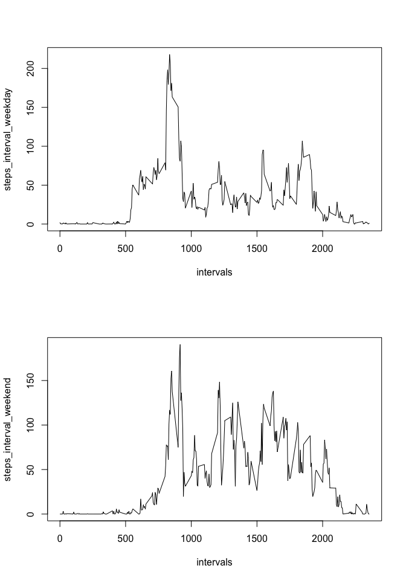

# Reproducible Research: Peer Assessment 1

## Description
The following report describes the data about the steps taken per day in a series of intervals from an activity monitoring device. The measures span from 2012-Oct-01, to  2012-Nov-30. Each day is divided into 288 intervals of different length.

## Loading and preprocessing the data


```r
#Set the working directory to load the cvs file
setwd("/Users/gibrangaribayfregoso/Documents/Actuari\314\201a/R/Coursera/Rep_Research/RepData_PeerAssessment1")

Data <- read.csv(file="activity.csv")
```
The dataset has three variables, steps, date and invertal. The variable date is treated as a factor; for convenience it is transformed into a R date variable.

```r
str(Data)
```

```
## 'data.frame':	17568 obs. of  3 variables:
##  $ steps   : int  NA NA NA NA NA NA NA NA NA NA ...
##  $ date    : Factor w/ 61 levels "2012-10-01","2012-10-02",..: 1 1 1 1 1 1 1 1 1 1 ...
##  $ interval: int  0 5 10 15 20 25 30 35 40 45 ...
```

```r
Data$date <- as.Date(Data$date)
```


## What is mean total number of steps taken per day?


Calculation of the measures per day. *Missing values are ignored.*

```r
days <- unique(Data$date)
steps_day <- vector(mode = "numeric")

for(j in 0:60){
  steps_day[j+1] <- sum(Data[Data$date == days[j+1],1],na.rm = TRUE)
}
```
Ditribution of the steps per day  

```r
hist(steps_day, breaks = 20)
```

<!-- -->

Median and mean

```r
median(steps_day)
```

```
## [1] 10395
```

```r
mean(steps_day)
```

```
## [1] 9354.23
```


## What is the average daily activity pattern?

For each interval, the mean over all days is calculated to produce a time series.*Missing values are ignored*

```r
intervals <- unique(Data$interval)
steps_interval <- vector(mode = "numeric")

for(j in 1:length(intervals)){
  steps_interval[j] <- mean(Data[Data$interval == intervals[j],1],na.rm = TRUE)
}
plot(intervals, steps_interval, type = "l")
```


Interval with the maximun number of steps on average.

```r
intervals[which.max(steps_interval)]
```

```
## [1] 835
```

## Imputing missing values


The dataset presents 2304 missing values for the steps variable in eight whole days, including the first and the last one.

```r
table(Data[is.na(Data$steps),2])
```

```
## 
## 2012-10-01 2012-10-08 2012-11-01 2012-11-04 2012-11-09 2012-11-10 
##        288        288        288        288        288        288 
## 2012-11-14 2012-11-30 
##        288        288
```
For filling the NAs the measures for each of the intervals from the previous day and the day after (without NAs) were averaged. For the first and last day, the data from the day after and the previous day were imputed respectively.


```r
#Which days have NAs
NA_dates <- unique(Data[is.na(Data$steps),2])

Full_Data <- Data

#First and last day imputing
Full_Data[Full_Data$date==NA_dates[1],1]<- Full_Data[Full_Data$date==NA_dates[1]+1,1]
Full_Data[Full_Data$date==NA_dates[8],1]<- Full_Data[Full_Data$date==NA_dates[8]-1,1]

#Fifth and sixth day, contiguous.
prev_day <- Full_Data[Full_Data$date == NA_dates[5]-1,1]
next_day <- Full_Data[Full_Data$date == NA_dates[5]+2,1]
Full_Data[Full_Data$date==NA_dates[5],1]<- (next_day+prev_day)/2
Full_Data[Full_Data$date==NA_dates[6],1]<- (next_day+prev_day)/2

#Rest of the days
for(j in c(2,3,4,7)){
  prev_day <- Full_Data[Full_Data$date == NA_dates[j]-1,1]
  next_day <- Full_Data[Full_Data$date == NA_dates[j]+1,1]
  Full_Data[Full_Data$date==NA_dates[j],1]<- (next_day+prev_day)/2
}
```
Missing values can introduce bias into the analysis, nevertheless theres no flawless method to replace them, some methods might reduce the quality of the information.Here the distribution is reploted for the new dataset.

```r
steps_day_f <- vector(mode = "numeric")

for(j in 0:60){
  steps_day_f[j+1] <- sum(Full_Data[Full_Data$date == days[j+1],1])
}

par(mfrow=c(2,1))

hist(steps_day_f,breaks = 20)
hist(steps_day,breaks = 20)
```


For the new dataset, with the missing values replaced the median is 1.0571\times 10^{4} against the median with the original dataset 1.0395\times 10^{4}. The mean reports a value of 1.0372\times 10^{4} and 9354 respectively. These values and the differences in the histograms show that imputing the missing values through the method described above, makes the distribution of the data more even, in other words it reduces the entropy of the variable. 


## Are there differences in activity patterns between weekdays and weekends?

The number of steps averaged through the days for each interval were ploted, this time making a distinction between the week days and the weekends in order to observe a difference in the patterns of the time series. The average steps per interval seem to accumulate earlier for the week days and have a decrease in the late intervals whereas the pattern for the weekends tend to be uniformly accumulated after mid day. This may be due to the difference in the activities performed by the subject between the two kinds of days. 


```r
w <- factor(c("weekend","weekday"))

is.weekday <- function(x){
  x <- weekdays(x)
  if(x == "Saturday" | x == "Sunday"){
    z <- w[1]
  }
  else{
    z <- w[2]
  }
  z
}

Full_Data$weekday <- sapply(Full_Data$date, is.weekday)

steps_interval_weekday <- vector(mode="numeric")
steps_interval_weekend <- vector(mode="numeric")

for(j in 1:length(intervals)){
  steps_interval_weekday[j] <- mean(Full_Data[Full_Data$interval == intervals[j] & Full_Data$weekday == "weekday",1])
  steps_interval_weekend[j] <- mean(Full_Data[Full_Data$interval == intervals[j] & Full_Data$weekday == "weekend",1])
}

par(mfrow=(c(2,1)))
plot(intervals, steps_interval_weekday, type = "l")
plot(intervals, steps_interval_weekend, type = "l")
```



